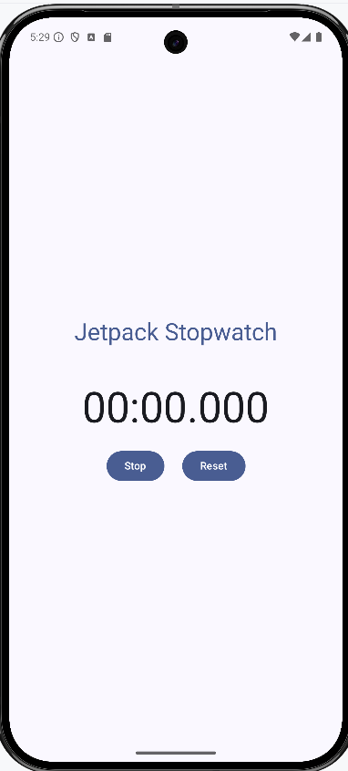
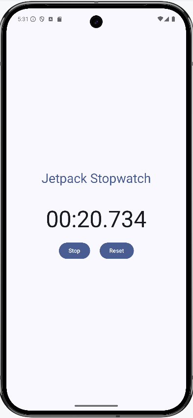

# Jetpack Stopwatch

A simple stopwatch app built with Jetpack Compose, demonstrating modern Android development practices.

## Table of Contents

-   [Features](#features)
-   [Screenshots](#screenshots)
-   [Getting Started](#getting-started)
    -   [Prerequisites](#prerequisites)
    -   [Installation](#installation)
-   [Usage](#usage)
-   [Code Structure](#code-structure)
-   [Dependencies](#dependencies)
-   [Contributing](#contributing)
-   [License](#license)
-   [Acknowledgements](#acknowledgements)
-   [Contact](#contact)
- [Project Link](#project-link)

## Features

-   **Flow-based Time Capture:** Uses Kotlin Flows to emit time updates, providing a reactive and efficient way to track elapsed time.
-   **MVVM Architecture:** Implements the Model-View-ViewModel architectural pattern for a clean separation of concerns and testability.
-   **Koin for Dependency Injection:** Leverages Koin for dependency injection, making the code more modular and easier to manage (although it might be considered a bit overkill for this specific project's size).
-   **Jetpack Compose UI:** Built entirely with Jetpack Compose, the modern UI toolkit for Android.
  - **Start/Stop/Reset**: The user can start, stop and reset the stopwatch.

## Screenshots

## Getting Started

### Prerequisites

-   Android Studio (latest version recommended)
-   Android SDK (API level 21 or higher)
-   Basic knowledge of Kotlin and Jetpack Compose

### Installation

1.  **Clone the repository:**
2.  **Open in Android Studio:**

    -   Open Android Studio and select "Open an existing Android Studio project."
    -   Navigate to the cloned repository directory and select it.

3.  **Build and Run:**

    -   Connect an Android device or start an emulator.
    -   Click the "Run" button in Android Studio.

## Usage

Once the app is running, you'll see a simple stopwatch interface.

-   **Start:** Tap the "Start" button to begin the stopwatch.
-   **Stop:** Tap the "Stop" button to pause the stopwatch.
-   **Reset:** Tap the "Reset" button to reset the stopwatch to zero.

## Code Structure

-   **`MainActivity.kt`:** The main activity that hosts the Compose UI.
-   **`StopwatchViewModel.kt`:** The ViewModel responsible for managing the stopwatch logic and state.
-   **`StopwatchState.kt`:** Data class representing the state of the stopwatch.
- **`Stopwatch.kt`**: Contains the composable function for the stopwatch.
- **`KoinModule.kt`**: Contains the Koin module for dependency injection.

## Dependencies

-   **Jetpack Compose:**
    -   `androidx.compose.ui:ui`
    -   `androidx.compose.material:material`
    -   `androidx.compose.ui:ui-tooling-preview`
    -   `androidx.compose.ui:ui-graphics`
-   **Kotlin Coroutines:**
    -   `org.jetbrains.kotlinx:kotlinx-coroutines-android`
-   **Koin:**
    -   `io.insert-koin:koin-android`
-   **Android Core KTX:**
    - `androidx.core:core-ktx`

## Contributing

Contributions are welcome! If you'd like to contribute to this project, please follow these steps:

1.  Fork the repository.
2.  Create a new branch for your feature or bug fix.
3.  Make your changes and commit them.
4.  Push your changes to your forked repository.
5.  Submit a pull request.

## License

This project is licensed under the MIT License - see the [LICENSE](LICENSE) file for details.

## Acknowledgements

This project is based on the original article by Dharma Kshetri:
[https://medium.com/@dharmakshetri/stopwatch-app-with-mvvm-coroutines-and-jetpack-compose-aa033e2ec042](https://medium.com/@dharmakshetri/stopwatch-app-with-mvvm-coroutines-and-jetpack-compose-aa033e2ec042)

## Contact

Donald McCaskey - [forteanjo@sky.com](mailto:forteanjo@sky.com)

## Project Link

[https://github.com/forteanjo/jetpack-stopwatch](https://github.com/forteanjo/jetpack-stopwatch)
